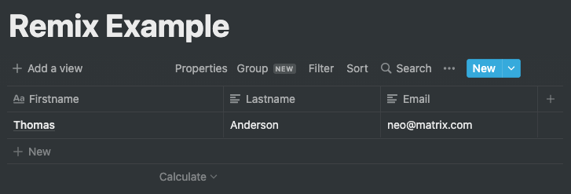
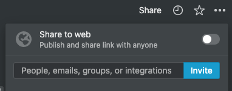

# Remix Notion Example

This is an example of how to submit a form to a Notion DB.

Create a Table page in Notion, and add columns:
* Firstname
* Lastname
* Email

Then head over to the [Notion API Documentation](https://developers.notion.com/) to generate an API key. You will have to click the `My integrations` on the top right to create an integration and generate an API key.

Go back to your Notion page, click `Share` in the top right, and search for the integration you just created and give it access to the DB.

In the same `Share` dialog, click `Copy Link`. This will give you a link to your page.

It should look something like this:
https://www.notion.so/{DB-ID}?v={PAGE-ID}

Copy the `DB-ID` from the URL and add it to the `.env` file under the key `NOTION_DB_ID`.
Also add your API key to the `NOTION_TOKEN` key.

Then just run `npm run dev` to start up remix, and submit your form!